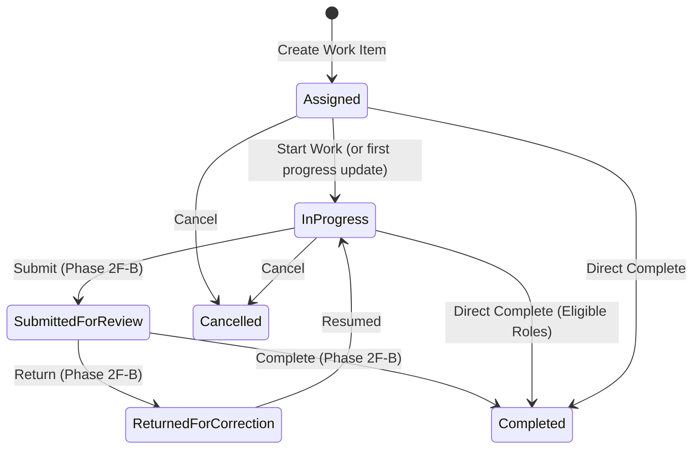

# Phase 2F — Operational Work Management Architecture

## 1. Executive Summary & Core Objective

The Land Acquisition Cell (LAC) Platform coordinates multi-officer administrative and legal operations across Delhi land acquisition matters, inward correspondence (Dak), and outward dispatches. Historically, officers and administrative staff operated in silos, requiring manual tracking of tasks, assignments, notes, and progress reports.

Phase 2F introduces **Operational Work Management** — a domain model and workflow engine that bridges officers, desks, and core acquisition records through accountable, audited, and immutable work assignments.

Phase 2F-A specifically delivers the **Work Item Core and My Work Experience**:
1. **Vertical Domain Slice**: Work items, assignments, future-ready contributor schema, progress updates, document attachments, and typed context links.
2. **First-Class My Work Projection**: An action-oriented workbench for every active officer, computing Delhi-time (`Asia/Kolkata`) workload buckets (Overdue, Due Today, This Week, Assigned, Requested).
3. **Rigorous Live Authorization**: Live database evaluation enforcing scope levels (`All`, `Workstream`, `Assigned`, `Own`), guaranteeing that designation never confers implicit authority.
4. **Context Isolation**: Work items are independent entities; typed links to Matters or Dak records enforce caller authorization before revealing target record details.
5. **Multi-Layer Immutability & Audit**: Strictly immutable events guarded by database triggers (`trg_work_item_events_immutable`) and EF Core change tracker interceptors; append-only progress updates; deterministic revision concurrency with row locking.

---

## 2. Core Architectural Invariants

### 2.1 Designation Is Not Authority
- System authority is derived exclusively from active RBAC role-permission assignments and active organization memberships (`OfficeDeskUser`, `OfficeDeskWorkstream`, `UserWorkstreamMembership`).
- No conditional checks on designation strings (e.g., `designation == "ADM"` or `designation == "Tehsildar"`) exist in business logic or authorization routines.
- Cross-workstream assignments are permitted only when the assigning officer holds `WorkItem.Assign` in both the source context and target workstream, and the assigned officer is an active member of the target desk.

### 2.2 Context Isolation
- `WorkItem` is a top-level aggregate root, **not** a child of `Matter` or `Dak`.
- While a work item may link to a Matter (`WorkItemMatterLink`) or a Dak entry (`WorkItemDakLink`), holding permission on a work item grants **no implicit permission** to view or modify linked records.
- When retrieving work item details or list projections, target Matter or Dak titles and reference numbers are redacted unless the caller independently possesses `Matter.View` or `Dak.View`.

### 2.3 Strict Immutability & Event History
- **`WorkItemEvent`**: Represents official administrative record history.
  - No API endpoint allows modification or deletion.
  - EF Core `SaveChangesAsync` intercepts and throws an `InvalidOperationException` if any `WorkItemEvent` is marked as `EntityState.Modified` or `EntityState.Deleted`.
  - PostgreSQL database trigger (`trg_work_item_events_immutable`) enforces immutability at the database engine level.
- **`WorkItemUpdate`**: Official progress notes and remarks.
  - Append-only.
  - No edit or delete paths exist in the API or UI.
  - Guarded in EF Core `SaveChangesAsync` against modification or deletion.

### 2.4 Time & Date Discipline (Delhi IST)
- All database timestamps are stored in UTC (`DateTimeOffset`).
- Operational calendar boundaries (Overdue, Due Today, Due This Week) are evaluated using Delhi standard time (`Asia/Kolkata` / `India Standard Time`) via `IOfficeClock`.
- Day boundaries (start of day 00:00:00 IST to end of day 23:59:59.999 IST) are translated to UTC when calculating summary statistics and querying projections, ensuring identical metrics regardless of server or client locale.

---

## 3. Domain Model & Lifecycle

### 3.1 Entities & Relationships
1. **`WorkItem`**: Aggregate root capturing title, description, priority (`Routine`, `Urgent`, `Immediate`), status (`Assigned`, `InProgress`, `SubmittedForReview`, `ReturnedForCorrection`, `Completed`, `Cancelled`), origin (`Manual`, `SystemGenerated`), `DueAt`, `SeenAt`, and optimistic concurrency `Revision`.
2. **`WorkItemAssignment`**: Captures assigned `OfficeDeskId`, assigned `UserId`, assigned by `UserId`, instructions, and `IsActive` flag. Exactly one active assignment per work item.
3. **`WorkItemContributor`**: Future-ready schema capturing collaborative participation with status (`Active`, `Submitted`, `Returned`, `Accepted`, `Removed`). In Phase 2F-A, contributor schema and events exist without exposing user-facing premature delegation authority.
4. **`WorkItemUpdate`**: Immutable progress entries containing progress notes, status changes, and author attribution.
5. **`WorkItemAttachment`**: Cross-references physical files stored via `IDocumentStorage` with original filename, MIME type, file size, SHA-256 hash, and uploader identity.
6. **`WorkItemMatterLink` & `WorkItemDakLink`**: Typed relationship links connecting work items to core records.
7. **`WorkItemEvent`**: Append-only audit trail capturing sequence numbers, 21 granular event actions, actor attribution, timestamp, and optional context changes.

### 3.2 State Machine

---

## 4. Authorization Matrix

| Operation | Required Permission | Allowed Scopes | Constraints |
| :--- | :--- | :--- | :--- |
| **View My Work** | `WorkItem.View` | All, Workstream, Assigned | Filtered by caller's active desk and workstream memberships |
| **View Work Item** | `WorkItem.View` | All, Workstream, Assigned | Caller must belong to workstream, active desk, or be assigned |
| **Create Work Item** | `WorkItem.Create` + `WorkItem.Assign` | All, Workstream | Caller must have scope in target workstream; target desk and user must be active |
| **Mark Seen** | `WorkItem.View` | Assigned | Direct assigned officer or active member of assigned desk |
| **Start Work** | `WorkItem.Update` | Assigned | Direct assigned officer or active member of assigned desk |
| **Add Update** | `WorkItem.Update` | All, Workstream, Assigned | Must be assigned, workstream officer, or holding `ScopeMode.All` |
| **Attach Document** | `WorkItem.Update` | All, Workstream, Assigned | Requires write access; content validated via magic bytes |
| **Remove Document**| `WorkItem.Update` | All, Workstream, Assigned | Only creator or officer with `All` scope |
| **Download Content**| `WorkItem.View` | All, Workstream, Assigned | Authorized work item viewer can stream verified files |

---

## 5. Concurrency & Retry Resilience

- **Optimistic Concurrency**: Every mutation validates `Revision == request.ExpectedRevision`. If a conflict occurs, a `409 Conflict` status is returned.
- **Pessimistic Row Locking**: On relational databases (PostgreSQL), mutative operations acquire an explicit row lock (`SELECT ... FOR UPDATE`) to eliminate race conditions during concurrent updates.
- **Idempotent Retry Verification**: Operations generate unique operation and event IDs outside retry loops. In case of transient connection failure, the service verifies whether the immutable event was already committed before executing compensating actions.
- **Safe File Upload**: Physical files are validated against allowed MIME types and magic bytes, stored to disk once, and deleted if the database transaction aborts.

---

## 6. Frontend & User Experience

1. **My Work (`/my-work`)**:
   - Interactive KPI summary cards for **Overdue**, **Due Today**, **This Week**, **Assigned to Me/My Desk**, and **Requested by Me**.
   - Actionable filters (Search, Workstream, Status, Due Horizon, Relationship).
   - Rich card layouts displaying priority pills, countdown timers, desk custody, and isolated context hints.
2. **Assign Work (`/work/new`)**:
   - Context-aware creation prefilling Matter or Dak references.
   - Dynamic loading of active workstreams, eligible desks, and assigned officers.
   - Immediate attachment of supporting documentation.
3. **Work Item Workspace (`/work/:id`)**:
   - Header banner with live priority, status, and assignment custody.
   - Single-click **Start Work** transition.
   - Form for appending official progress notes.
   - Isolated context cards linking to Matter or Dak details (with automatic authorization detection).
   - Document repository with drag-and-drop file upload, download streaming, and deletion.
   - Chronological event timeline recording every administrative action.
4. **Integration Seams**:
   - **Matter Workspace**: Quick "+ Assign Work" action button in the action strip.
   - **Dak Detail Workspace**: Quick "+ Assign Work" action button in the custody action strip.

---

## 7. Migration & Extensibility Roadmap

- **Database Migration**: `AddWorkItemFoundation` adds all 8 tables, indexes, and foreign keys.
- **Database Trigger**: Implements PostgreSQL trigger `trg_work_item_events_immutable` preventing any `UPDATE` or `DELETE` on `WorkItemEvents`.
- **Phase 2F-B Seams**:
  - Full collaborative contributor lifecycle (`WorkItemContributor` acceptance, review submission, return, and accept).
  - Multi-desk forwarding and custody transfers.
  - Automated SLA tracking and escalation notifications.
