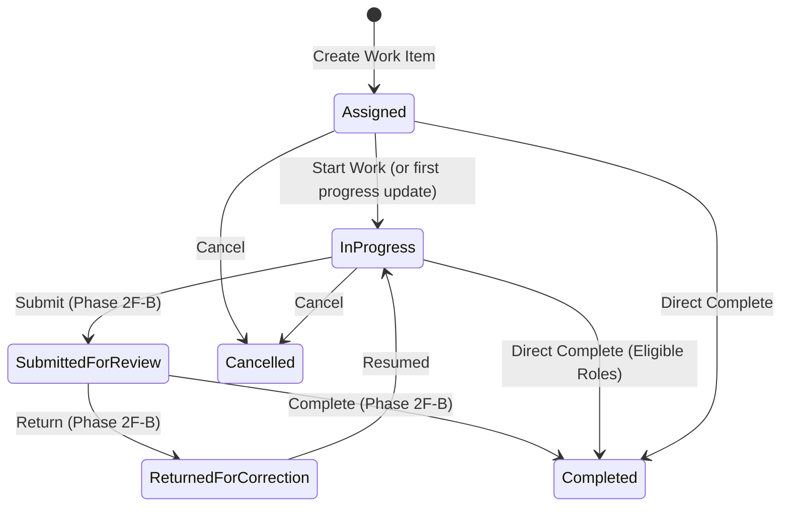

# Phase 2F — Operational Work Management Architecture

## 1. Executive Summary & Core Objective

The Land Acquisition Cell (LAC) Platform coordinates multi-officer administrative and legal operations across Delhi land acquisition matters, inward correspondence (Dak), and outward dispatches. Historically, officers and administrative staff operated in silos, requiring manual tracking of tasks, assignments, notes, and progress reports.

Phase 2F introduces **Operational Work Management** — a domain model and workflow engine that bridges officers, desks, and core acquisition records through accountable, audited, and immutable work assignments.

Phase 2F-A specifically delivers the **Work Item Core and My Work Experience**:
1. **Vertical Domain Slice**: Work items, assignments, future-ready contributor schema, progress updates, document attachments, and typed context links.
2. **First-Class My Work Projection**: An action-oriented workbench for every active officer, computing Delhi-time (`Asia/Kolkata`) workload buckets (Overdue, Due Today, This Week, Assigned, Requested).
3. **Rigorous Live Authorization**: Live database evaluation enforcing scope levels (`All`, `Workstream`, `Assigned`, `Own`), guaranteeing that designation never confers implicit authority.
4. **Context Isolation**: Work items are independent entities; typed links to Matters or Dak records enforce caller authorization before revealing target record details.
5. **Multi-Layer Immutability & Audit**: Strictly immutable events guarded by database triggers (`trg_work_item_events_immutable`) and EF Core change tracker interceptors; append-only progress updates; deterministic revision concurrency with row locking.

---

## 2. Core Architectural Invariants

### 2.1 Designation Is Not Authority & Live Organizational State
- System authority is derived exclusively from active RBAC role-permission assignments and live organization memberships (`UserDeskMembership`, `OfficeDesk`, `UserWorkstreamMembership`).
- No conditional checks on designation strings (e.g., `designation == "ADM"` or `designation == "Tehsildar"`) exist in business logic or authorization routines.
- **Desk Classification vs. Routing Authority**: `OfficeDesk.WorkstreamId` is optional classification metadata only; it is **not** tenancy, authorization, security boundary, or routing authority. `WorkItem.WorkstreamId` is the explicit functional and authorization classification. An assigning officer holding `WorkItem.Assign` authority in the target Workstream may route work items to any active `OfficeDesk` regardless of the desk's optional workstream classification, provided any named assignee holds a live active `UserDeskMembership` in that target desk. Routing to a desk does not infer or grant caller record authority in that desk's classified workstream.
- **Institutional Desk Responsibility vs. Named Handlers**: `OfficeDesk` represents institutional responsibility. `AssignedUserId` is an optional named handler metadata/routing hint and does not make an `OfficeDesk` assignment private. All live active members of an assigned `OfficeDesk` share `Assigned`-scope responsibility regardless of whether `AssignedUserId` is null or points to another current handler.
- **Live Assignment Responsiveness**: Under `ScopeMode.Assigned`, direct assignment responsibility does **not** survive the loss of required live desk membership. A caller qualifies under `ScopeMode.Assigned` only while the assignment is active, the assigned `OfficeDesk` is active and has `RecordStatus == Active`, the caller is active, and the caller holds a live active `UserDeskMembership` in that exact assigned `OfficeDesk`. Any named handler who loses live active desk membership immediately loses `Assigned`-scope access, while all other live active desk members retain institutional responsibility.

### 2.2 Context Isolation
- `WorkItem` is a top-level aggregate root, **not** a child of `Matter` or `Dak`.
- While a work item may link to a Matter (`WorkItemMatterLink`) or a Dak entry (`WorkItemDakLink`), holding permission on a work item grants **no implicit permission** to view or modify linked records. Context Matter and Dak permissions remain strictly independent.
- When retrieving work item details or list projections, target Matter or Dak titles and reference numbers are redacted unless the caller independently possesses `Matter.View` or `Dak.View`.

### 2.3 Strict Immutability & Event History
- **`WorkItemEvent`**: Represents official administrative record history.
  - No API endpoint allows modification or deletion.
  - EF Core `SaveChangesAsync` intercepts and throws an `InvalidOperationException` if any `WorkItemEvent` is marked as `EntityState.Modified` or `EntityState.Deleted`.
  - PostgreSQL database trigger (`trg_work_item_events_immutable`) enforces immutability at the database engine level.
- **`WorkItemUpdate`**: Official progress notes and remarks.
  - Append-only.
  - No edit or delete paths exist in the API or UI.
  - Guarded in EF Core `SaveChangesAsync` against modification or deletion.

### 2.4 Time & Date Discipline (Delhi IST)
- All database timestamps are stored in UTC (`DateTimeOffset`).
- Operational calendar boundaries (Overdue, Due Today, Due This Week) are evaluated using Delhi standard time (`Asia/Kolkata` / `India Standard Time`) via `IOfficeClock`.
- Day boundaries (start of day 00:00:00 IST to end of day 23:59:59.999 IST) are translated to UTC when calculating summary statistics and querying projections, ensuring identical metrics regardless of server or client locale.

---

## 3. Domain Model & Lifecycle

### 3.1 Entities & Relationships
1. **`WorkItem`**: Aggregate root capturing title, description, priority (`Routine`, `Urgent`, `Immediate`), status (`Assigned`, `InProgress`, `SubmittedForReview`, `ReturnedForCorrection`, `Completed`, `Cancelled`), origin (`Manual`, `SystemGenerated`), `DueAt`, `SeenAt`, and optimistic concurrency `Revision`.
2. **`WorkItemAssignment`**: Captures assigned `OfficeDeskId`, assigned `UserId`, assigned by `UserId`, instructions, and `IsActive` flag. Exactly one active assignment per work item.
3. **`WorkItemContributor`**: Future-ready schema capturing collaborative participation with status (`Active`, `Submitted`, `Returned`, `Accepted`, `Removed`). In Phase 2F-A, contributor schema and events exist without exposing user-facing premature delegation authority.
4. **`WorkItemUpdate`**: Immutable progress entries containing progress notes, status changes, and author attribution.
5. **`WorkItemAttachment`**: Cross-references physical files stored via `IDocumentStorage` with original filename, MIME type, file size, SHA-256 hash, and uploader identity.
6. **`WorkItemMatterLink` & `WorkItemDakLink`**: Typed relationship links connecting work items to core records.
7. **`WorkItemEvent`**: Append-only audit trail capturing sequence numbers, 21 granular event actions, actor attribution, timestamp, and optional context changes.

### 3.2 State Machine

---

## 4. Authorization Matrix

| Operation | Required Permission | Allowed Scopes | Constraints |
| :--- | :--- | :--- | :--- |
| **View My Work** | `WorkItem.View` | All, Workstream, Assigned | Filtered by caller's active desk and workstream memberships |
| **View Work Item** | `WorkItem.View` | All, Workstream, Assigned | Caller must belong to workstream, active desk, or be assigned |
| **Create Work Item** | `WorkItem.Create` + `WorkItem.Assign` | All, Workstream | Caller must have scope in target workstream; target desk and user must be active |
| **Mark Seen** | `WorkItem.View` | Assigned | Direct assigned officer (with live active desk membership) or active member of assigned desk |
| **Start Work** | `WorkItem.Update` | Assigned | Direct assigned officer (with live active desk membership) or active member of assigned desk |
| **Add Update** | `WorkItem.Update` | All, Workstream, Assigned | Must be assigned, workstream officer, or holding `ScopeMode.All` |
| **Attach Document** | `WorkItem.Update` | All, Workstream, Assigned | Requires write access; content validated via magic bytes |
| **Remove Document**| `WorkItem.Update` | All, Workstream, Assigned | Requires write access (`WorkItem.Update`); item must not be completed/cancelled; soft deletes active record |
| **Download Content**| `WorkItem.View` | All, Workstream, Assigned | Authorized work item viewer can stream verified files |

---

## 5. Concurrency & Retry Resilience

- **Optimistic Concurrency**: Every mutation validates `Revision == request.ExpectedRevision`. If a conflict occurs, a `409 Conflict` status is returned.
- **Pessimistic Row Locking**: On relational databases (PostgreSQL), mutative operations acquire an explicit row lock (`SELECT ... FOR UPDATE`) to eliminate race conditions during concurrent updates.
- **Idempotent Retry Verification**: Operations generate unique operation and event IDs outside retry loops. In case of transient connection failure, the service verifies whether the immutable event was already committed before executing compensating actions.
- **Safe File Upload**: Physical files are validated against allowed MIME types and magic bytes, stored to disk once, and deleted if the database transaction aborts.

---

## 6. Frontend & User Experience

1. **My Work (`/my-work`)**:
   - Interactive KPI summary cards for **Overdue**, **Due Today**, **This Week**, **Assigned to Me/My Desk**, and **Requested by Me**.
   - Actionable filters (Search, Workstream, Status, Due Horizon, Relationship).
   - Rich card layouts displaying priority pills, countdown timers, desk custody, and isolated context hints.
2. **Assign Work (`/work/new`)**:
   - Context-aware creation prefilling Matter or Dak references.
   - Dynamic loading of active workstreams, eligible desks, and assigned officers.
   - Immediate attachment of supporting documentation.
3. **Work Item Workspace (`/work/:id`)**:
   - Header banner with live priority, status, and assignment custody.
   - Single-click **Start Work** transition.
   - Form for appending official progress notes.
   - Isolated context cards linking to Matter or Dak details (with automatic authorization detection).
   - Document repository with drag-and-drop file upload, download streaming, and deletion.
   - Chronological event timeline recording every administrative action.
4. **Integration Seams**:
   - **Matter Workspace**: Quick "+ Assign Work" action button in the action strip.
   - **Dak Detail Workspace**: Quick "+ Assign Work" action button in the custody action strip.

---

## 7. Migration & Extensibility Roadmap

- **Database Migration**: `AddWorkItemFoundation` adds all 8 tables, indexes, and foreign keys.
- **Database Trigger**: Implements PostgreSQL trigger `trg_work_item_events_immutable` preventing any `UPDATE` or `DELETE` on `WorkItemEvents`.
- **Phase 2F-B Seams**:
  - Full collaborative contributor lifecycle (`WorkItemContributor` acceptance, review submission, return, and accept).
  - Multi-desk forwarding and custody transfers.
  - Automated SLA tracking and escalation notifications.

---

## 8. Phase 2F-B: Delegated Assistance, Contribution and Review Workflow

Phase 2F-B establishes the formal delegation, contribution, and review model for work items.

### 8.1 Responsible Officer ≠ Contributor
- **Institutional Custody vs. Delegated Assistance**: `OfficeDesk` and `AssignedUserId` hold official institutional custody and accountability for completing the work item. A **Contributor** (`WorkItemContributor`) is an invited assistant/collaborator who provides specialized preparation, notes, or evidence without assuming institutional responsibility.
- **FirstAction Separation**: Contributor participation by itself does NOT establish `WorkItemAssignment.FirstActionAt` or `WorkItemAssignment.FirstActionByUserId`. However, if the same actor independently qualifies as a live member of the responsible `OfficeDesk`, their action may establish `FirstAction` under normal frozen 2F-A responsibility semantics. This preserves the invariant: *who contributed* $\neq$ *who assumed official responsibility*, while allowing one human to hold both roles independently.

### 8.2 Bounded Positive Grant — Never a Deny ACL
- **RBAC Union Semantics**: The `WorkItemContributor` relationship is a **bounded positive grant**, not a negative ACL.
  $$\text{Effective Authority} = \text{Independent Authority (All / Workstream / Desk)} \cup \text{Contributor-Derived Authority}$$
- **Survival of Independent Authority**: If an officer possesses independent authority via `ScopeMode.All`, `ScopeMode.Workstream` (with live workstream membership), or `ScopeMode.Assigned` (via live responsible desk membership), that authority remains fully active regardless of whether that user also has a contributor record in `Submitted`, `Accepted`, or `Removed` status.
- **Contributor-Derived Scope**: For users whose sole access to a work item is derived from their contributor record:
  - **Active / Returned**: Grants `WorkItem.View`, `WorkItem.Update`, and `WorkItem.Contribute` for that exact work item.
  - **Submitted**: Grants `WorkItem.View` only. Contributor-derived mutation (`Update`, `Contribute`) is locked while pending review.
  - **Accepted / Removed**: Contributor-derived authority ends entirely (`IsActive = false`).

### 8.3 Contributor State Machine & Independent Lifecycle
- **Contributor States**: `Active (0)` $\rightarrow$ `Submitted (1)` $\rightleftharpoons$ `Returned (2)` $\rightarrow$ `Accepted (3)` or `Removed (4)`.
- **Multiple Independent Contributors**: A work item can have multiple contributors working concurrently in independent lifecycles without interfering with one another's revision or review states.
- **Submission Decoupling**: Contributor submission (`SubmitContribution`) does **not** mutate global `WorkItem.Status`. Global status transitions (such as `SubmittedForReview`) are reserved for whole-item supervisory review.
- **Acceptance Decoupling**: Accepting a contribution (`AcceptContribution`) marks the contributor as accepted and inactive (`IsActive = false`), but does **not** complete the work item (`WorkItem.Status` remains `InProgress` or `Assigned`).
- **Strict Actor Rule**: Only the exact assigned contributor (`c.UserId == callerUserId`) can execute `SubmitContributionAsync`. No submit-on-behalf is allowed.
- **Exact Review Authority**: Returning or accepting a contribution requires explicit `WorkItem.Review` authority. The return operation mandates non-empty remarks explaining required corrections.

### 8.4 Contributor Eligibility
- Eligible contributors must already possess active RBAC capability for **both** `WorkItem.View` and `WorkItem.Contribute` under qualifying scope (`All`, `Workstream`, or `Assigned`).
- `WorkItem.Update` alone is insufficient because contribution submission strictly checks `WorkItem.Contribute`.

### 8.5 Immutable Contributor Events & Audit
- All contributor mutations emit dedicated, immutable `WorkItemEvent` rows:
  - `ContributorAdded`
  - `ContributorSubmitted`
  - `ContributorReturned`
  - `ContributorAccepted`
  - `ContributorRemoved`
- Contributor updates and attachments are attributed in event snapshots with `ContributorId`, preserving full historical context even if the contributor is subsequently removed.
- Retry resilience and ambiguity verifiers verify exact event snapshots (`Id`, `WorkItemId`, `Action`, `ContributorId`, `TargetUserId`) as immutable proofs of commit.

### 8.6 My Work Operational Projection Semantics
- **Operational Participation Intersect Exact View Authorization**: My Work is **not** a general WorkItem directory or an all-viewable-records projection. It strictly reflects:
  $$\text{My Work} = \text{Operational Participation} \cap \text{Exact WorkItem.View Authorization}$$
  An item is operationally relevant only if the caller is on the responsible desk, requested the item, participates as an active contributor (`Active`, `Submitted`, `Returned`), or holds actionable review authority over an active submitted contributor.
- **Scope Invariants**:
  - `ScopeMode.All` on View removes the authorization boundary, but does **not** bypass the operational participation requirement.
  - `ScopeMode.Workstream` grants record authority within that workstream, but does **not** turn My Work into a workstream directory.
  - `RequestedByUserId` establishes operational relevance, but is **not** an Assigned view authorization grant.
- **Needs Review**: Work items where at least one active contributor is in `Submitted` status, and the caller possesses `WorkItem.Review` authority (unioned across `All`, `Workstream`, and responsible-Desk `Assigned`). Contributor relation alone never satisfies Review.
- **Assigned Review Exact Active Invariant**: Evaluating `WorkItem.Review` via `ScopeMode.Assigned` strictly requires `CurrentAssignment != null`, `CurrentAssignment.IsActive == true`, `CurrentAssignment.RecordStatus == RecordStatus.Active`, and the caller holding live active membership in that assignment's `OfficeDesk`. Stale or inactive assignments are excluded.
- **Returned to Me**: Work items where the caller is an active contributor in `Returned` status.
- **Helping**: Work items where the caller is an active contributor in `Active`, `Submitted`, or `Returned` status.
- **Waiting on Others**: Work items where the caller is a responsible desk officer or requester, and at least one contributor is active (`Active`, `Submitted`, or `Returned`).

### 8.7 UI / UX Integration
- **Help & Contribution Workspace Card**: Displays contributor badges, current statuses, and instructions.
- **Modal Dialogs**: "Ask for Help", "Submit Contribution", and "Return for Correction" modals guide multi-officer collaboration directly within the work item workspace.

---

## 9. Phase 2F-C: Branch Pulse and secure routing

Branch Pulse is authorized operational-area health, not My Work. My Work remains operational participation intersected with exact View authorization; Pulse unions `WorkItem.View` All, live Workstream membership, and live responsible-desk Assigned scope. Contributors and requesters do not expand Pulse scope, and no designation is treated as supervisory authority.

`WorkItemAssignment` is assignment-cycle history. Current responsibility is the one active, active-record assignment; there is no `CurrentAssignmentId` pointer. The approved Phase 2F-C migration replaces the old unconditional work-item uniqueness constraint with a PostgreSQL partial unique index, so old cycles close and remain official evidence while at most one current cycle exists.

Reassignment requires exact `WorkItem.Assign`, a current active assignment, a non-terminal item, reason and expected revision. It closes the old cycle, starts a fresh one without FirstSeen/FirstAction, preserves contributors and status, and emits immutable `Reassigned` history with structured source/target IDs and desk/user name snapshots. Desk workstream is classification only and does not change WorkItem workstream or constrain routing. AssignedUserId remains a non-private routing hint; “No Named Handler” means the desk remains responsible.

Pulse attention and workload values are live projections: overdue, Delhi-date due today, submitted contribution review, active/returned help, Assigned status, no named handler, and stale LastActivityAt. They are never persisted performance scores. The responsive `/branch-pulse` screen provides summary cards, desk filters, operational rows, loading, error and empty states, and links to the Work workspace for authorized routing actions.
